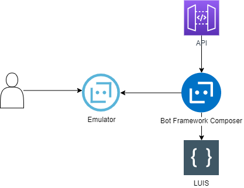

# Bot na Microsoft Azure - Sprawozdanie część praktyczne
---
### Link do filmu wyślę na MS Teams
---
### Scenariusz / Use case
Stworzyłem swój własny scenariusz, nie podany w propozycjach - bot dla osób zainteresowanych zdrowym odżywianiem - "NutritionBot".
Realizuje on dwie możliwe ścieżki rozmów - oferuje informacje o składnikach odżywczych dowolnego produktu, lub przygotowuje menu z 3 dań dla użytkownika.

W wiadomości powitalnej użytkownik jest informowany o możliwych tematach do rozmów. Następnie, w zależności od tego na jaki scenariusz rozmowy użytkownik się zdecyduje, wykonywany jest jeden z przedstawionych use casów. W celu uzyskania odpowiedzi w obu przypadkach kożystam z zewnętrznego API.

- Use case "Pytanie o składniki odżywcze": Po wybraniu tego tematu bot prezentuje przykładowe pytaie w języku naturalnym na które jest w stanie (przy pomocy zewnętrznego API) odpowiedzieć. Następnie podane pytanie jest wysyłane do API a użytkownikowi wyświetlana jest odpowiedź.

- Use case "Stworzenie diety na 1 dzień": Po wybraniu tego tematu użytkownikowi zostanie zadany szereg pytań o jego preferencje żywnościowe. Ustalane jest czy użytkownik jest wszystkożerny/wegetarianinem/weganinem. Następnie bot pyta się o liczbę kalorii jaką mają mieć łącznie przedstawione przez niego propozycje. Po otrzymaniu odpowiedzi wysyłane jest zapytanie do API, a odpowiedź jest wyświetlana w odpowiednim formacie.

---
### Wykonane kroki
1. Zainstalowanie Bot Framework Composera i Bot Framework Emulatora.
2. Stworzenie zasobu LUIS na platformie Azure.
3. Znalezienie odpowiedniego API realizującego przedstawiony problem - https://rapidapi.com/spoonacular/api/recipe-food-nutrition
4. Stworzenie głównego scenariusza z wiadomością powitalną.
5. Stworzenie pobocznych scenariuszy (dialogów) reprezentujących przedstawione use casy.
6. Stworzenie odpowiednich requestów do API.
7. Stworzenie wielu wiadomości by bot odpowiadał za każdym razem inaczej.
8. Stworzenie triggerów w oparciu o LUISA.
9. Stworzenie dialogu "Cancel"
10. Deployment i testy bota w Bot Framework Emulator.

---
### Architektura

---
### Kod + niezbędne dane
kod przedstawiony w folderze bot-code

Niezbędne dane:
Odwołania do api:
- https://spoonacular-recipe-food-nutrition-v1.p.rapidapi.com/recipes/mealplans/generate
- https://spoonacular-recipe-food-nutrition-v1.p.rapidapi.com/recipes/quickAnswer

